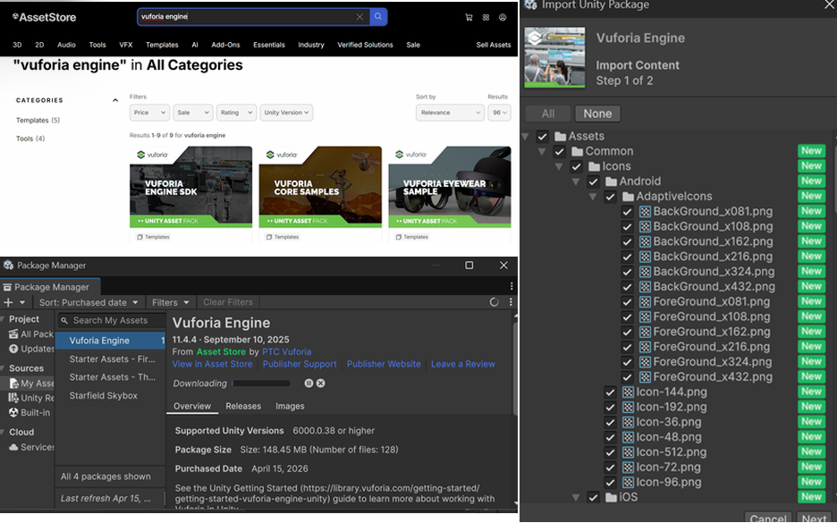
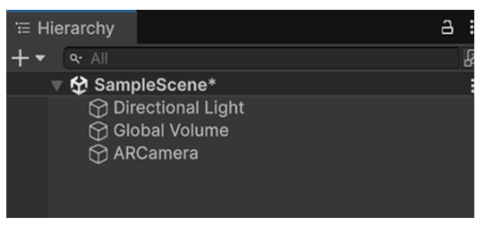
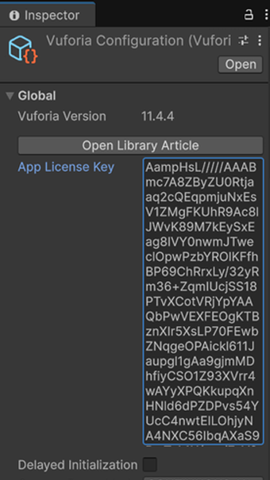
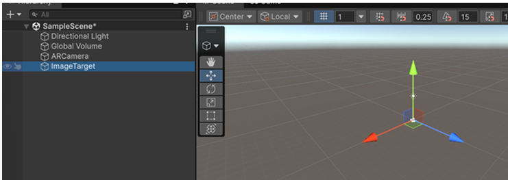
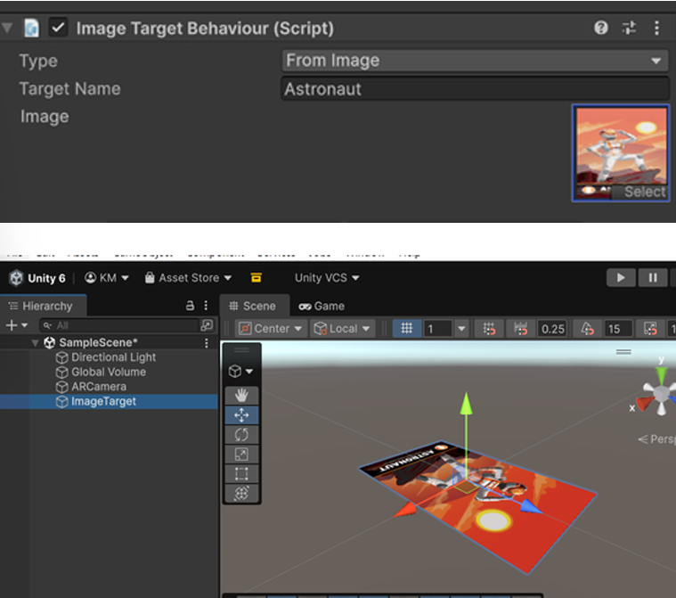
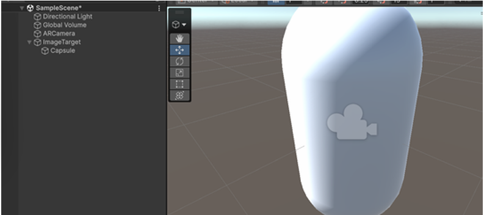
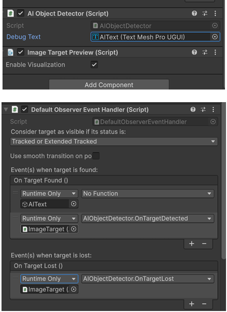
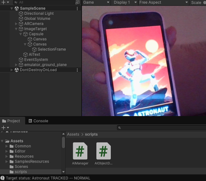
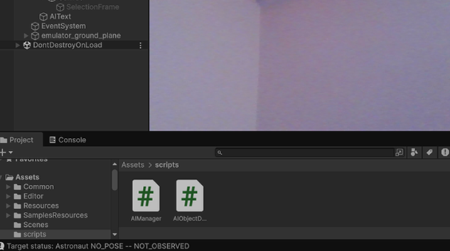

# Rapport de TP : Application AR Intelligente avec Vuforia

## Réalisé par
- Ghizlane Aitelhaj
- Khadija El Merahy

## 1. Introduction
Ce projet consiste en la réalisation d'une application de réalité augmentée (AR) développée avec Unity 6. L'application détecte une image cible et simule un processus d'analyse par intelligence artificielle afin d'identifier l'objet et d'afficher des données enrichies.

## 2. Configuration de l'environnement
- **Moteur AR** : Vuforia Engine SDK 11.4.4
- **Plateforme de test** : Webcam PC (Windows)
- **Cible (Target)** : Image de l'astronaute (format US Letter)

### Installation
Le package Vuforia a été importé via l'Asset Store et configuré dans Unity pour permettre l'accès à la caméra et la reconnaissance d'image.

## 3. Mise en oeuvre technique
### A. Configuration de la scène
Remplacement de la caméra standard par une ARCamera.

Activation de la licence.

Ajout d'une Image Target liée à la base de données VuforiaMars_Images.

Utilisation de l'asset `target_astronaut_USLetter` (7 cm x 12 cm) comme point d'ancrage.

### B. Contenu virtuel et interface IA
Objet 3D : une capsule est placée en tant qu'enfant de l'Image Target pour suivre ses mouvements.

UI Text : un composant TextMeshPro affiche les messages d'état de l'IA.

### C. Développement du script IA (AIObjectDetector)
Un script C# a été créé pour piloter l'interaction. Il utilise les événements de Vuforia (`OnTargetFound` et `OnTargetLost`) pour déclencher la logique suivante :

- **Détection** : activation du cadre vert et message "Analyse du flux vidéo..."
- **Identification** : après un délai, affichage du résultat "Astronaute identifié (98%)"

## 4. Résultats et validation
Les tests effectués en mode "Play" avec la webcam confirment le bon fonctionnement :

- **Suivi (Tracking)** : les logs de la console indiquent `Astronaut TRACKED` dès que l'image est visible.

- Si l'image n'apparaît pas, un message `NOT OBSERVED` s'affiche.

## 5. Conclusion
Ce TP a permis de maîtriser la chaîne de développement AR complète. L'intégration d'un script personnalisé simulant une inférence IA démontre la capacité de l'application à traiter des données visuelles pour générer un contenu augmenté interactif et informatif.